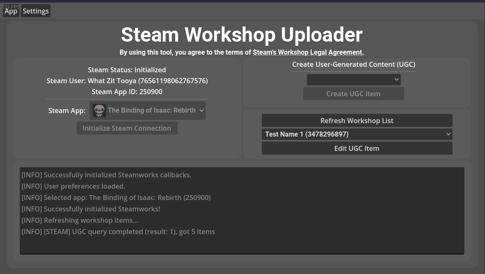

# Steam Workshop Uploader

A simple tool made in Godot. It helps you upload workshop items to any app on Steam. I made this because I was annoyed with the clunky tool I had to use for uploading mods for the Binding of Isaac.

## Features

- Intuitive user interface.
- Supports modifying an item's title, description, visiblity, and tags.
- Display preview of an item's BBCode description.
- Supports displaying thumbnails, including GIFs.
- Open source, contributions are welcome!

## Upcoming Features
- [] Support uploading thumbnails, including GIFs.
- [] Support uploading a workshop item folder (basic)
- [] Support excluding files from the upload (via UI or `.steamignore`)
